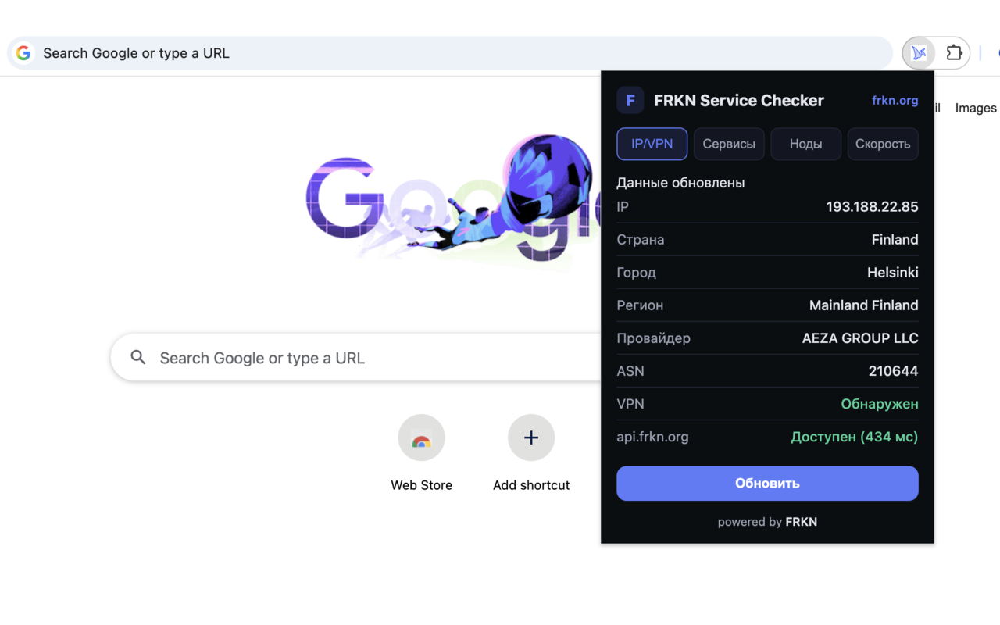
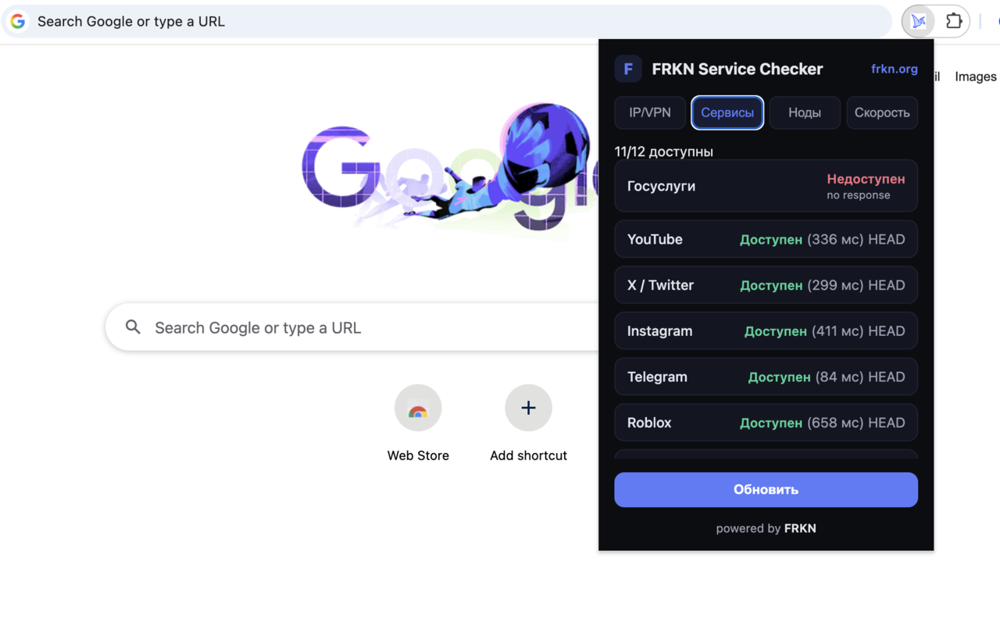

# FRKN Service Checker

[](https://status.frkn.org)
[](https://chromewebstore.google.com/detail/frkn-service-checker/elngedoofkkabmcnnldncempkklofmkh)
[](https://addons.mozilla.org/en-US/firefox/addon/frkn-service-checker/)

> A browser-first network diagnostic toolkit: real IP/VPN detection, service availability checks, FRKN node status, and a speed test — all running directly in your browser.

[🌐 Live status page](https://status.frkn.org) · [🧩 Chrome extension](https://chromewebstore.google.com/detail/frkn-service-checker/elngedoofkkabmcnnldncempkklofmkh) · [🦊 Firefox extension](https://addons.mozilla.org/en-US/firefox/addon/frkn-service-checker/)

---

## ✨ What it does

- **🛡️ IP & VPN detection**  
  Shows your external IP, country, ISP, ASN and tries to detect VPN / proxy / datacenter usage.

- **📡 FRKN servers status**  
  Loads the live list of FRKN nodes and checks the health of each server plus the FRKN API.

- **🌐 Service availability** *(browser extension)*  
  Checks if popular sites and services are reachable from your exact network — not from some remote server.

- **⚡ Speed test**  
  Measures real download speed by fetching test files directly in the browser.

> Because everything runs client-side, you get results for **your connection**, not an average of someone else's.

---

## 🖼️ Screenshots

| Status Page | Browser Extension |
|-------------|-------------------|
|  |  |

---

## 🚀 Install

### Website
Just open **[status.frkn.org](https://status.frkn.org)** in any modern browser.

### Browser extension

- **[Chrome / Edge / Chromium](https://chromewebstore.google.com/detail/frkn-service-checker/elngedoofkkabmcnnldncempkklofmkh)** — Chrome Web Store
- **[Firefox](https://addons.mozilla.org/en-US/firefox/addon/frkn-service-checker/)** — Firefox Add-ons

The extension can read HTTP responses, so it detects ISP block pages and captive portals more accurately than a regular web page.

---

## 🛠️ Tech stack

- **Rust** + **Leptos** (CSR) compiled to **WebAssembly**
- **Tailwind CSS** for styling
- **Trunk** for building the WASM app
- Vanilla **JavaScript** for the browser extension

---

## 🏃 Quick start

```bash
# 1. Add the WASM target (once)
rustup target add wasm32-unknown-unknown

# 2. Install trunk (once)
cargo install trunk

# 3. Run the dev server
trunk serve --port 8080

# 4. Open http://127.0.0.1:8080
```

### Build for production

```bash
trunk build --release
```

Static files will be in `dist/`.

### Build browser extensions

```bash
./build-extension.sh
```

Produces:

- `frkn-service-checker-store-chrome.zip`
- `frkn-service-checker-store-firefox.zip`

### Deploy

```bash
./deploy.sh [hostname]
```

If `hostname` is omitted, defaults to the project's production server.

---

## 🔒 Privacy

The app and extension **do not collect, store or transmit any personal data**. All checks are performed locally in the user's browser. See the privacy policy:

- [English](https://status.frkn.org/privacy-en.html)
- [Русский](https://status.frkn.org/privacy.html)

---

## 🤝 Contributing

This project is open source. If you want to hack on Rust + WebAssembly on a real-world project that people actually use, send patches!

1. Fork the repo
2. Create a feature branch
3. Run `cargo check --target wasm32-unknown-unknown` and `trunk build --release`
4. Open a pull request

---

## 📝 License

MIT — feel free to use, modify and share.

---

## 🙌 Powered by

[FRKN](https://frkn.org) — the last free internet project without marketing bullshit.

---

<details>
<summary>🇷🇺 Русская версия</summary>

# FRKN Service Checker

[](https://status.frkn.org)
[](https://chromewebstore.google.com/detail/frkn-service-checker/elngedoofkkabmcnnldncempkklofmkh)
[](https://addons.mozilla.org/ru/firefox/addon/frkn-service-checker/)

> Набор сетевой диагностики прямо в браузере: определение IP/VPN, доступность сервисов, статус нод FRKN и замер скорости — всё работает локально у пользователя.

[🌐 Статус-страница](https://status.frkn.org) · [🧩 Расширение для Chrome](https://chromewebstore.google.com/detail/frkn-service-checker/elngedoofkkabmcnnldncempkklofmkh) · [🦊 Расширение для Firefox](https://addons.mozilla.org/ru/firefox/addon/frkn-service-checker/)

## ✨ Возможности

- **🛡️ IP и VPN** — внешний IP, страна, провайдер, ASN и попытка определить VPN/прокси/дата-центр.
- **📡 Серверы FRKN** — актуальный список нод и проверка доступности API.
- **🌐 Доступность сервисов** *(расширение)* — проверяет сайты из вашей сети, а не с удалённого сервера.
- **⚡ Speed test** — замер скорости загрузки тестового файла.

## 🚀 Установка

### Сайт
Просто откройте **[status.frkn.org](https://status.frkn.org)**.

### Расширение

- **[Chrome / Edge / Chromium](https://chromewebstore.google.com/detail/frkn-service-checker/elngedoofkkabmcnnldncempkklofmkh)**
- **[Firefox](https://addons.mozilla.org/ru/firefox/addon/frkn-service-checker/)**

Расширение читает HTTP-ответы, поэтому отличает реальный сайт от провайдерской заглушки.

## 🛠️ Стек

- **Rust** + **Leptos** (CSR), скомпилировано в **WebAssembly**
- **Tailwind CSS**
- **Trunk**
- Vanilla **JavaScript** для расширения

## 🏃 Быстрый старт

```bash
rustup target add wasm32-unknown-unknown
cargo install trunk
trunk serve --port 8080
```

Откройте http://127.0.0.1:8080.

### Сборка

```bash
trunk build --release          # сайт
./build-extension.sh            # расширения
./deploy.sh [hostname]          # деплой
```

## 🔒 Приватность

Приложение и расширение **не собирают, не хранят и не передают персональные данные**. Все проверки выполняются локально в браузере.

- [Политика конфиденциальности](https://status.frkn.org/privacy.html)
- [Privacy Policy](https://status.frkn.org/privacy-en.html)

## 🤝 Контрибьютинг

Проект открытый. Если хочешь поработать с Rust + WebAssembly на реальном проекте — присылай патчи!

## 📝 Лицензия

MIT.

## 🙌 Powered by

[FRKN](https://frkn.org).

</details>
